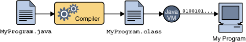

!SLIDE 
# Cómo funciona java #

!SLIDE bullets

##El proceso general

* Tomás un archivo *fuente* (`.java`)
* Lo *compilás* y se genera *bytecode* (`.class`)
* La JVM interpreta el bytecode, buscando objetos con los cuales interactuar
* Si ejecutás una clase que tiene un método `main`, es un programa principal

!SLIDE center

!SLIDE center

!SLIDE 

#Los archivos fuente

!SLIDE code small

    @@@java
    //en Promedio.java
    public class Promedio{
       public static int calcularPromedio(int[] nums){
        int sum = 0;
        for(int n: nums)
            sum += n;
        return sum/nums.length;
       }
       public static void main(String[] args){
        int[] elems = {5,1,12,6,8};
        System.out.println(calcularPromedio(elems));
       }
    }

!SLIDE smbullets
#Sobre las clases

* Los archivos fuente tienen la definición de una *clase* pública
* Un archivo `.java` tiene una clase pública con el mismo nombre
* Una clase es el *concepto de un objeto*.
* La clase (general) o sus *instancias* (copias específicas) son *dueñas* de *métodos*.
* Un método `static` le pertenece a una clase *directamente*

!SLIDE code

    @@@sh
    $ dir
    Promedio.java
    $ javac Promedio.java
    $ dir
    Promedio.java 
    Promedio.class

!SLIDE bullets
#La compilación

* Cuando ejecutás `javac Archivo.java`, creás un archivo de *bytecode*
* Que tiene instrucciones que la JVM entiende
* Por cada clase de objetos habrá un archivo `.class`

!SLIDE code

    @@@sh
    $ java Promedio
    6.4

!SLIDE smbullets
#La máquina virtual
* La máquina virtual agarra el bytecode y lo *interpreta*
* Cuando le das el *nombre* de una clase, le pregunta a ese concepto si sabe cómo responder a `main`
* Si la clase sabe, decimos que es un *punto de entrada* y se ejecuta lo que esté ahí
* Si no sabe (no lo tiene definido), es una clase que debería ser usada por otras.
* En otras palabras: en el mundo de java sólo existen las *clases*.

!SLIDE smbullets
#Programas en java
* En java, usás *instancias* de clases para programar, siempre hay objetos interactuando con otros
* A veces interactuás con una clase directamente (como `Math`), y a veces con instancias (como objetos `Scanner`)
* Pero siempre, *siempre*, una función le pertenecerá a un objeto; por eso se llaman *métodos*
* De modo que, en realidad, para hacer algo útil vas a tener que hacer que objetos se *pasen mensajes entre sí*
* Una clase es el *concepto general* para construir *objetos específicos*

!SLIDE bullets 
## Referencias 

* [Head first java, capítulo 1](http://www.headfirstlabs.com/books/hfjava/)
* [The java language specification, capítulo 12](http://java.sun.com/docs/books/jls/)
* [Introducción al lenguaje](http://download.oracle.com/javase/tutorial/getStarted/intro/index.html)
* [The java language environment](http://download.oracle.com/javase/tutorial/getStarted/intro/index.html)
