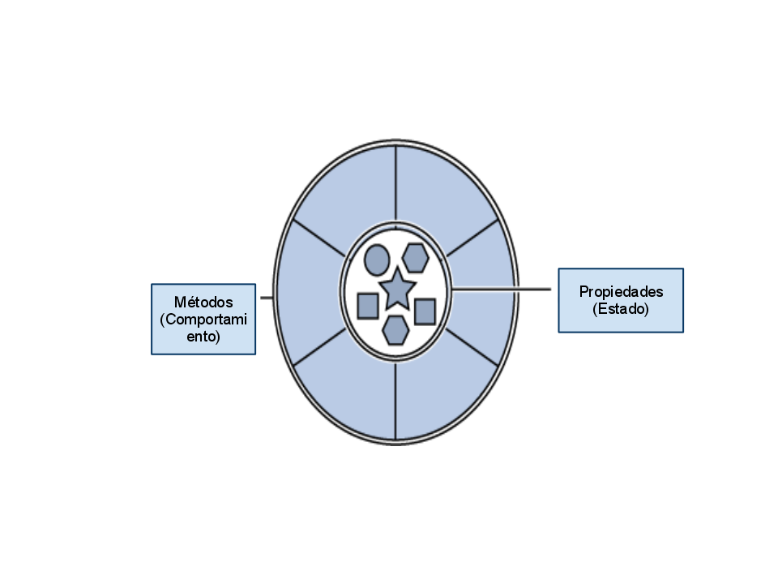

!SLIDE 

# Programación orientada a objetos

!SLIDE bullets incremental

* Dada una cadena de caracteres, encontrar todos
  los dígitos y devolver la suma de éstos
* `int sumaDigitos(String cadena)`

!SLIDE code small

    @@@java
    public static int sumInts(String cadena){
        int res = 0;
        for(char letra : cadena.toCharArray())
            if(Character.isDigit(letra))
                res += Integer.parseInt(
                        Character.toString(letra));
        return res;
    }

!SLIDE bullets incremental

## Abstracción: clases e instancias

* ¿Qué son `int`, `String`, `char`, `Character` e `Integer`?
* Son **conceptos generales**
* O *clases* (aunque `int` y  `char` son primitivos)
* ¿Qué son `cadena`, `res` y `letra`?
* Son **objetos específicos**: *instancias de clases/tipos/conceptos*

!SLIDE bullets incremental

## Abstracción: paso de mensajes

* `s.toCharArray()`=> "s, sos un String, ustedes saben 
   convertirse en arreglos de chars, ¡hacelo!"
* `Character.isDigit(c)`: los primitivos son *mudos*
   y necesitan *wrappers* (digámosles Chaperones).
* ¿Cómo funcionan `toCharArray` o `isDigit`?
* ¡A nadie le importa!

!SLIDE bullets 

##Abstracción: estado y comportamiento

* En el mundo de los objetos hay dos cosas
* Lo que son por dentro: *estado (propiedades)*
* ¿Qué hay dentro de un String?
* Y lo que pueden hacer: *comportamiento (métodos)*
* El resultado: programar diciendo *qué* hacer, no *cómo*

!SLIDE bullets

##¿Para qué sirve?

* Para preocuparte del *qué* y no el *cómo*
* Si te olvidás del *cómo* de algo, podés hacer cosas más complejas
* ¿Qué hace la multiplicación? vs ¿cómo funciona?

!SLIDE center

